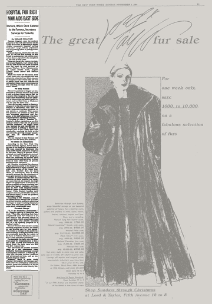

HOSPITAL FOR RICH NOW AIDS EAST SIDE
===
By RONALD SULLIVAN
---
NOV. 4, 1984
---

[Hospital For Rich](https://www.nytimes.com/1984/11/04/nyregion/hospital-for-rich-now-aids-east-side.html) 

*The original version of this article appeared in the New York Times on November 4th, 1984. The printed article looked like this:* 

Doctors Hospital, once the medical preserve of the rich and famous on the Upper East Side, is becoming a highly visable community hospital serving Yorkville's large elderly population and its growing influx of young professionals.

Toward that end, the 54-year-old hospital, at 170 East End Avenue, at 86th Street, is undergoing a $40 million renovation that is expected to be completed by the end of next year.

Gone are the private rooms overlooking Gracie Mansion, Carl Schurz Park and the East River that were occupied over the years by such patients as James Thurber, Oscar Hammerstein 2d, Claire Boothe Luce, Eugene O'Neill<a href="#fn1" id="ref1">1</a>, Eddie Cantor and Marilyn Monroe.

While the views are the same, most of the rooms are now semiprivate and relatively celebrity-free. Gone, too, are the hospital worker whose only job was to polish silver and the food-service sommelier whose major preoccupation was selecting the right wine for a patient's dinner.

No Daily Rounds

Moreover, patients no longer are hospitalized at Doctors because they need a rest, as Robert Moses was in 1948. As in every other hospital in the city, patients must be seriously ill to be admitted, or else private and public health insurers such as Blue Cross or Medicare will not pay for their care.

There are no daily rounds at Doctors, because it is the only private, nonprofit hospital in Manhattan that does not have a physician teaching program, or any interns or residents. This means that patients are treated by their private attending physicians and surgeons, or by staff physicians who have completed their residency training.

According to John C. Donaher Jr., hospital's earlier reputation as an elite medical enclave that did not practice ''serious medicine'' no longer holds true. Instead, he said, the 263-bed, 14- floor hospital is seeking to become an intregal part of the Upper East Side community, reaching out both to the very old and a growing younger population that he characterized as ''Yuppies.<a href="#fn2" id="ref2">2</a>''

The one constant is that Doctors still does not care for many poor patients. No Clinics or Ambulances

According to the New York City Health Systems Agency, fewer than 1 percent of the hospital's admissions in 1982 were covered by Medicaid, the state public health insurance program for the poor. Nearly 60 percent of admissions were elderly patients covered by the Federal Medicare program, while the remaining 40 percent were private patients covered either by Blue Cross or some other form of private hospitalization insurance.

Mr. Donaher attributed the absence of poor patients partly to the hospital's being situated in a highly affluent, out- of-the way section of the Upper East Side. Also, Doctors does not have clinics or ambulances, both of which normally account for the admission of many poor patients in other hospitals.

Doctors is a small hospital that concentrates on basic medical and surgical cases that do not require the high degree of sophisticated or techical expertise available at large teaching hospitals that feature specialty services, such as New York Hospital-Cornell Medical Center or Mount Sinai Medical Center. While Doctors handles such surgical cases as gall-bladder removal and hernia repair, it does not perform open-heart surgery.

According to Mr. Donaher, most of the physicians at Doctors are on medical-school faculties and have admitting privileges at major teaching hospitals, where they send their patients who require more complicated care. 'Personal Charge'

''It is an interesting phenonema,'' Mr. Donaher said in an interview last week. ''They like admitting their less- complicated cases here because it allows them to take personal charge of their patients, which sometimes is not possible when your patient becomes part of a big teaching program at a medical center.''

Because Doctors does not have costly teaching programs, he said, the hospital can provide care for less money. This means a savings to the public because virtually all hospitalization costs are eventually borne by the public in the form of Federal Medicare costs or Blue Cross insurance premiums.

For example, the daily rate that Blue Cross pays for hospitalization at Doctors is $381. At New York Hospital and Mount Sinai, the daily rates are $558 and $541 respectively.

The renovation of Doctors includes plans for a new emergency room staffed by full-time physicians trained in emergency medicine, a radiology facility that includes nuclear medicine and ultrasound services, and an outpatient surgical center.

However, there is some doubt whether the hospital will become part of the city's 911 emergency ambulance system, given the proximity of major emergency rooms at other nearby hospitals.

1. [Eugene O'Neill was an American playwright and Nobel laureate in Literature. Author of *Long Day's Journey into Night*, *The Iceman Cometh*, and *Beyond the Horizon*.]<a href="#ref1" title="Jump back to footnote 1 in the text.">↩</a>

2. [A "Yuppie" is a young, college-educated adult who is employed in a well-paying profession and who lives and works in or near a large city]<a href="#ref2" title="Jump back to footnote 2 in the text.">↩</a>

